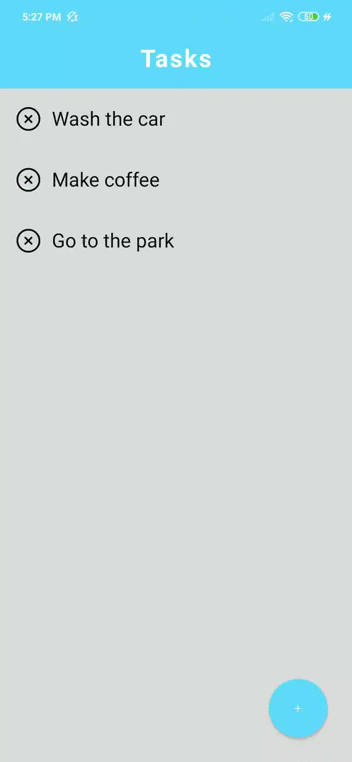

## 💻 Project

This is a very simple task application built on React Native and Expo.

 

  

 

## 🔧 How it Works

There are two features, the user can add a new task or delete an existing task.

## License

This project is licensed under the MIT License - see the [LICENSE](https://github.com/GabrielCordeiroDev/task-app/blob/main/LICENSE) file for details.
